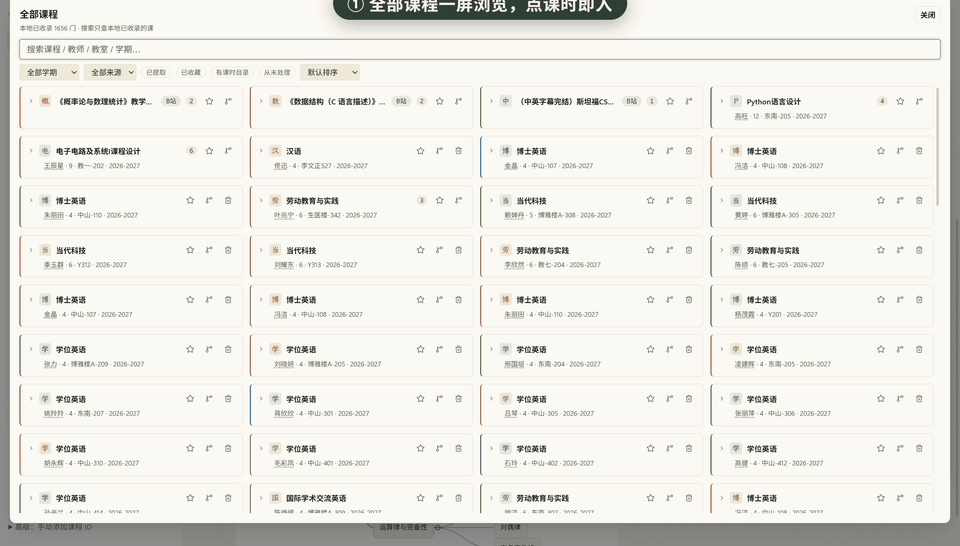
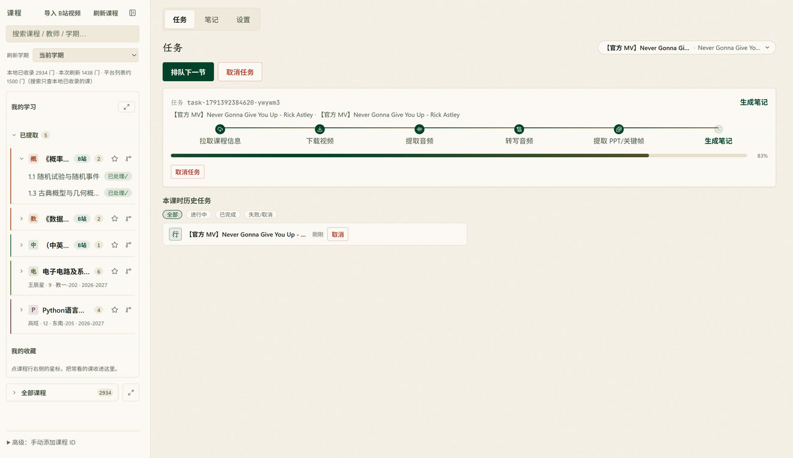
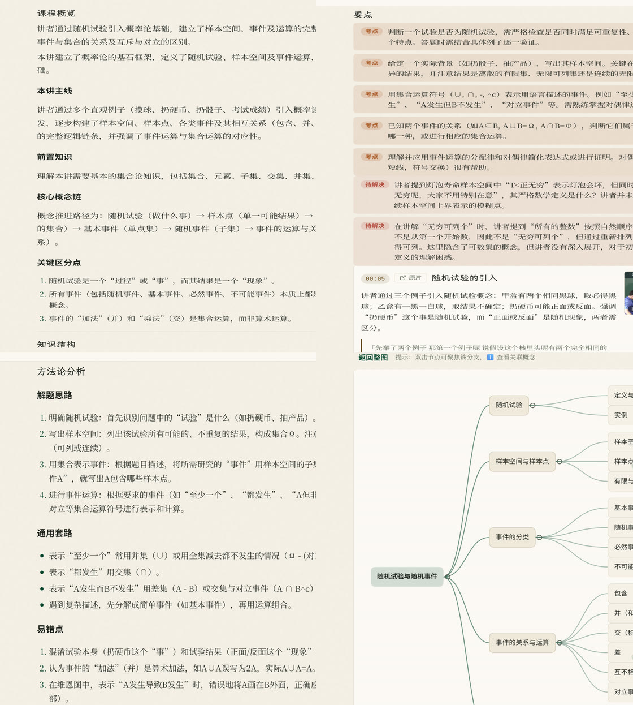
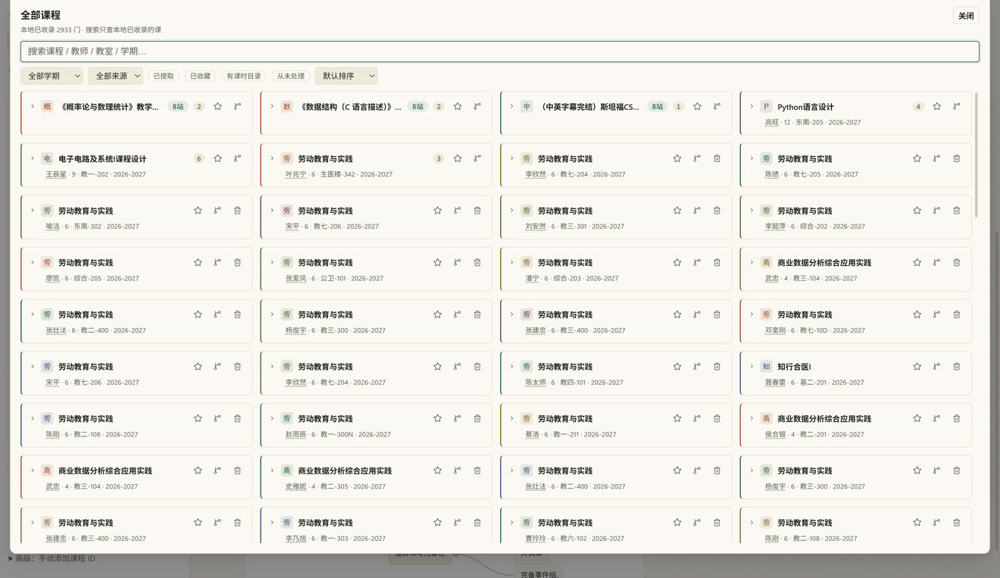
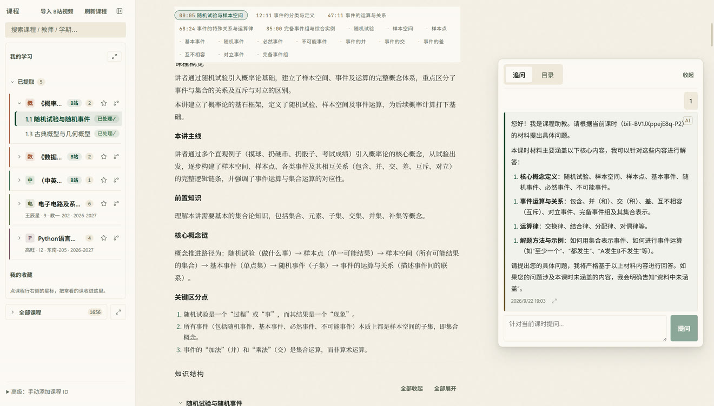
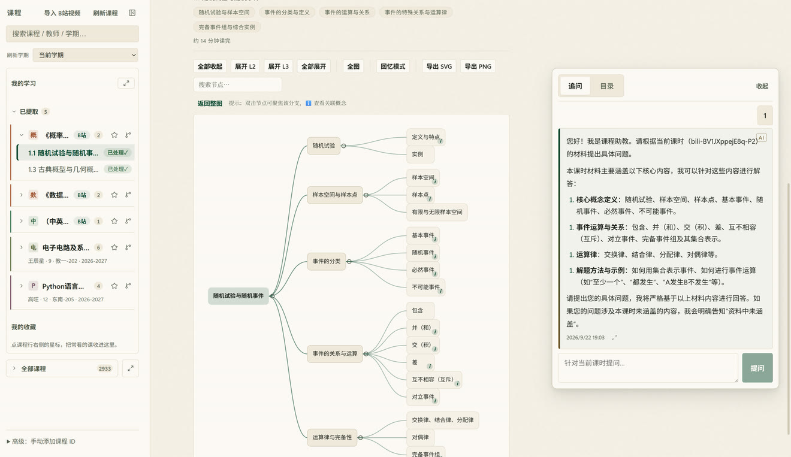
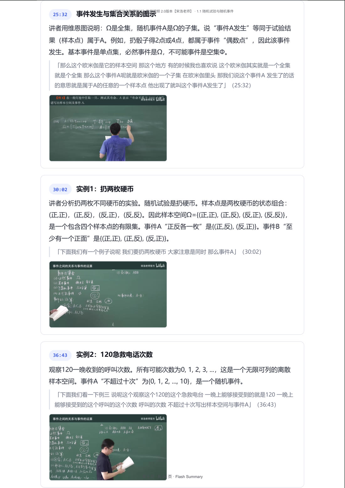
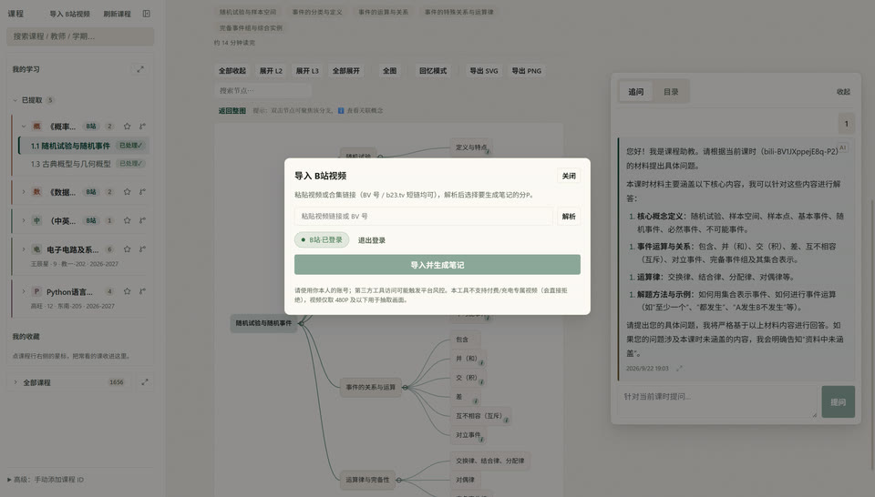
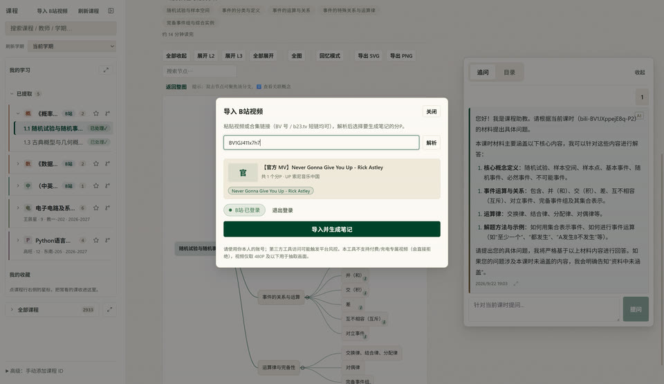

# Flash Summary

> 把东南大学科达录播课程与 B 站视频变成结构化学习笔记的 Windows 桌面应用。

[](https://github.com/Andiii208/flash-summary/actions/workflows/ci.yml)
[](https://github.com/Andiii208/flash-summary/releases)
[](LICENSE)


Flash Summary 是一款**本地优先**的 Windows 桌面应用：用你自己的 SEU CAS 账号登录（或导入 B 站视频），把课程视频（教师流 + 屏幕/PPT 流 + 平台 PPT）自动加工成**多模态结构化笔记**，阅读时还能**随时追问**。

- 没有开发者自有服务器——音频、文字、图片只发给**你自己配置**的 ASR / LLM Provider（OpenAI 兼容接口）。
- 你的资料库、转写、关键帧、笔记全部保存在本地。
- 全流程可断点续跑：失败的任务从失败阶段恢复，不重复已完成的工作。
- **宽屏自适应**：窗口放大后界面按物理宽度等比缩放铺满，不出现「大窗口 + 半屏空白」。

## 🖥️ 界面一览

核心流程：① 浏览课程 → ② 导入 B站视频即自动排队 → ③ 笔记生成 → ④ 阅读中追问 → ⑤ 导图 / 五视图 / PDF 讲义。



| 任务流水线（六阶段实时可见） | 同一份笔记的四种视图 |
| :---: | :---: |
|  |  |

| 全部课程一屏浏览 | 追问坞（读到哪里问到哪里） |
| :---: | :---: |
|  |  |

| 思维导图（按容器宽适合比例） | PDF 讲义导出（矢量文本） |
| :---: | :---: |
|  |  |

| 导入 B站视频：粘贴链接即解析预览 | 分P勾选后与校内课程同规格生成笔记 |
| :---: | :---: |
|  |  |

## ✨ 功能

| 模块 | 说明 |
|---|---|
| 🖥️ 界面 | Preact + «quiet academia» 设计语言：明暗主题、任务阶段轨道与进度、卡片 toast；宽屏按物理宽度等比缩放铺满 |
| 🔐 平台登录 | 主窗口内完成 CAS 授权并自动返回；会话 DPAPI 加密、重启免登录；徽标区分已登录/已过期；启动即对校园域名绕过系统代理 |
| 📚 课程/课时 | 「我的学习」聚合置顶（已提取/收藏/同课推荐）；折叠分组增量渲染 + 分页拉取；搜索防抖；**全屏课程浏览器**（Ctrl+K，筛选/排序）；手动 ID 后备入口 |
| ⏱️ 任务队列 | 六阶段流水线串行执行、**任意阶段可取消**；运行卡显示阶段轨道与进度；历史记录可筛选/重试/单条删除；失败原因翻译成人话 |
| 🎬 媒体管线 | 播放页收割视频直链与课时目录；教师流取音频（无音频轨回退屏幕流）；感知哈希抽关键帧去重；ffmpeg 超时与停滞检测 |
| 🗣️ ASR 转写 | 120 秒分片转写、片偏移拼接、静音分片跳过；HTTP Range 断点续传 |
| 🧠 多模态笔记 | 转写 + **真实 PPT/关键帧图片** → 多模态模型生成结构化笔记；时间锚引文逐条核验（核对不上的降级）；**一键重新生成**（复用已存转写与关键帧）+ 内容体检自动返修一次 |
| 📖 五种阅读视图 | 详细笔记（时间线图文卡片）/ 标准总结 / 要点 / 方法论 / **思维导图**——**同一份 JSON 投影**；时间线卡片自动绑定课堂关键帧；公式 LaTeX 排版；导图按容器宽适合比例、可全图浏览 |
| 💬 课时追问 | 笔记页右侧悬浮坞，上下文严格限本课时（转写 + 笔记 + PPT + 关键帧 + 历史问答）；空对话给章节建议问题 |
| 📤 导出 | **PDF 整册讲义**（封面 + 整页导图 + 图文正文 + 图集，矢量文本）、Markdown、Anki 牌组、Obsidian 结构化笔记、导图 SVG/PNG、剪贴板 |
| ⚙️ 设置 | Provider 预设模板 + 测试连接；任务缓存目录可改、资料库迁移与备份；主题、日志目录；「关于与声明」+ **检查更新**（只读本项目 GitHub Releases） |
| 📺 B站视频源 | 粘贴链接/BV号/b23.tv 短链 → 解析预览（分P勾选）→ 应用内扫码登录；**字幕优先**、无字幕 ASR 兜底；付费/充电专属内容明确拒绝 |
| 🗑️ 文件治理 | 音频转写成功后删除、视频抽帧成功后删除、>24h 缓存启动时清理（跳过运行中任务） |

## 🚀 安装

**[⬇ 下载最新版（GitHub Releases）](https://github.com/Andiii208/flash-summary/releases/latest)** — 需要 **Windows 10/11 x64**；ffmpeg 已内置，无需额外安装。当前版本 **v0.7.15**（2026-10-08），逐版本变更见 [CHANGELOG](CHANGELOG.md)，开发进度台账见 [PROGRESS.md](PROGRESS.md)。

- 下到的是 `Flash.Summary.Setup.<version>.exe`（GitHub 会把资产名里的空格换成点；与本地 `npm run dist` 产物是同一个包）。
- 安装程序会先显示**使用须知与第三方许可**（含内置 ffmpeg 的 GPL-3.0 说明与源码获取途径），需点「我同意」才能继续；条款全文随包放在安装目录的 `resources\legal\`。
- 首次启动会先弹出**使用须知与免责声明**（九条，须勾选同意；不同意则退出应用），随后按引导配置 Provider（ASR 转写 + 多模态总结）。

## ▶️ 快速开始

1. 双击启动，点「登录 CAS」——主窗口内完成学校平台授权后自动返回，课程树自动刷新（会话加密保存，重启免登录）；「刷新课程」上方的学期下拉与平台网站一致——选哪个学期就收录哪个学期的课程（默认当前学期，选择重启后仍生效）。
2. 左侧课程树点击课时即可创建任务；课程多用「全部课程」（行尾按钮或 Ctrl+K）全屏浏览，搜索/筛选后点课时直接选中；B站视频点侧栏「导入 B站视频」。
3. 任务排队串行执行，界面实时显示阶段与分片进度；需要时点「取消任务」；失败点历史任务中的「重试」——只会从失败阶段继续。
4. 完成后自动进入笔记：五种视图切换阅读，右侧追问坞随时就本课时提问；「导出 PDF 讲义」生成整册讲义（A4、封面、页码、含课堂画面），也可导出 Markdown / Anki / Obsidian。**窗口放大/最大化**后界面按物理宽度等比缩放铺满（任务卡双列、正文装订线居中、追问坞常驻），无需手动设置。

## 🔒 隐私与安全

- **无后端**：所有数据只在你本机与你自己配置的 Provider 之间流动。
- **凭据加密**：CAS 会话（Cookie + JWT）与 API Key 用 **Windows DPAPI** 加密落盘；绝不进入 Git、日志或文档。
- **视频直链**：课时收割得到的完整签名直链只在任务内部做阶段交接——任务**成功后即清除**，**取消时同样清除**；只有**失败**任务会为断点续跑短暂保留，且**超过直链有效期（校内课 6 小时 / B 站 100 分钟）后启动时自动清除**（重试成功、删除任务或清空历史也会立即清除）。课程库只保存去除签名参数的路径段。
- **红线**：严禁提交 `.env`、Cookie、TGT、API Key、`auth_key`、完整视频直链。
- **临时文件**：成功后即删；超过 24h 的缓存启动时自动清理。
- 课程资料属于学校教学资源，请勿公开转发——**全部导出出口（八个：PDF / Markdown / 剪贴板 / Anki / Obsidian 单课时 / Obsidian 整课 / 导图 SVG / 导图 PNG）都会给出提示**，可勾选「不再提示」。**完整条款见 [使用须知与免责声明](DISCLAIMER.md)**。

## ⚖️ 合规与使用声明

- **非官方工具**：Flash Summary 由个人开发，与**东南大学**及其信息化部门、与**哔哩哔哩**均无隶属、合作或授权关系。
- **个人学习用途**：请使用**你本人**的账号，仅处理你有权访问的内容，不做批量抓取、不二次分发。
- **数据流向**：音频、截图与转写文本只发往**你在设置里自己配置**的第三方 ASR/LLM 服务商——没有开发者自有服务器，不上报任何数据给开发者（无遥测、无埋点、无崩溃上报）。
- **账号风险**：使用第三方工具访问学校平台可能触发学校的安全策略（频率限制、风控、临时锁定），请自行确认符合学校规定。
- **版权**：课程与视频的著作权归学校、教师或原作者；导出的文件可能包含课程画面与他人肖像声音，**请勿公开转发或公开发布**。
- **技术边界**：不处理 B 站付费/充电专属内容、不请求会员清晰度、不下载全景流、不提供批量抓取、**不含任何 DRM 绕过或解密逻辑**。
- **AI 输出可能出错**：笔记由模型生成，请**以课程原始内容为准**。
- **反馈通道只给入口**：应用内的「测试期问题反馈」只展示反馈表二维码与链接，并把**已脱敏**的诊断信息复制到**你自己的剪贴板**——**没有任何自动上报**。失败任务旁有「反馈这个错误」一键取诊断。

> 以上为摘要。**全文（九条）见 [DISCLAIMER.md](DISCLAIMER.md)**；随包分发的第三方组件与许可（含内置 ffmpeg 的 **GPL-3.0** 说明与源码获取途径）见 [THIRD-PARTY-NOTICES.md](THIRD-PARTY-NOTICES.md)。应用内可在「设置 → 关于与声明」查看同一份文本。

## 🧯 常见问题

- **课时收割失败 / 播放提示「播放资源获取失败」**：若你在用 Clash 等代理的 **TUN 模式**，学校视频服务器 `dncvsvod.seu.edu.cn` 通常不在常见分流库里，会被送去代理出口而连不上。解决：代理规则加 `DOMAIN-SUFFIX,seu.edu.cn,DIRECT`，或临时关闭 TUN 模式（**订阅更新会冲掉自加规则**；应用检测到 Fake-IP 解析时会明确提示）。
- **登录跳转白屏 / 平台页超时**：应用已对 `*.seu.edu.cn` 自动绕过系统代理；若仍失败请检查 Clash TUN 是否接管（见上一条）。
- **会话频繁过期**：学校平台会话本身有时效，过期后点「登录 CAS」重新授权即可（已保存的资料库与笔记不受影响）。
- **安装版与开发版数据隔离**：安装版用 `%APPDATA%\seu-summary`，开发运行（`npm run dev`）用 `%APPDATA%\seu-summary-dev`，两者会话互不相通；课程资料库共用。

## 🛠️ 开发者

```bash
npm run dev          # 开发模式（热重载）
npm run lint         # ESLint
npm run typecheck    # TypeScript strict（node + web 双工程）
npm test             # vitest
npm run build        # electron-vite 构建到 out/
npm run smoke        # 构建并运行 CDP 进程级烟测
npm run dist         # 构建 NSIS 安装包到 release/
```

- 技术栈：**Electron 44 + TypeScript strict**（三进程隔离，sandbox + contextIsolation）；renderer 用 **Preact**；本地库 **better-sqlite3**；媒体 **ffmpeg-static/ffprobe-static**（已打包）；笔记 schema 用 **zod** 校验；安装包 **electron-builder**；测试 **vitest**（**1632 个用例 / 145 个文件**，含真实 HTTP 集成与六阶段端到端 e2e）。架构与目录结构见 [docs/ARCHITECTURE.md](docs/ARCHITECTURE.md)。
- CI（GitHub Actions，windows-latest）每个 push 跑两条工作流：**CI**（lint + typecheck + test + build）与 **Smoke**（打包产物进程级烟测）。
- README 配图由 `node scripts/readme-shots.mjs` 生产（真库副本 CDP 实拍，零新依赖）；**UI 大改后重跑它以更新截图**。
- 测试基线：**1632 个用例 / 145 个测试文件**（`npm test`，只增不减）；提交前跑全四门禁（`npm run lint && npm run typecheck && npm test`），改 IPC 桥面另跑 `npm run smoke`。
- Windows + git-bash 环境下若 `npm` 报 "cannot execute"，请用 `npm.cmd`。

## 📖 更多文档

- [设计规格](docs/superpowers/specs/2026-08-30-seu-summary-desktop-mvp-design.md)（唯一规格来源）· [ROADMAP](docs/plans/ROADMAP.md)（阶段计划）· [MVP 验收记录](docs/acceptance/MVP.md)
- [AGENTS.md](AGENTS.md)（工程约定）· [PROGRESS.md](PROGRESS.md)（断点续跑台账）

## 🤝 贡献

MVP 范围明确不做：云端同步、多用户、本地 ASR、macOS。已交付并超出初版 MVP 边界（均经用户批准，见 [ROADMAP](docs/plans/ROADMAP.md) 与相应方案）：PDF 讲义导出、**B 站作为第二视频源**、Obsidian / Anki 结构化导出。

欢迎在 issue 中讨论需求；改动请保持小而聚焦的 Conventional Commits，并在提交前通过全部门禁（`npm run lint && npm run typecheck && npm test`）。

## 📄 License

[MIT](LICENSE)
